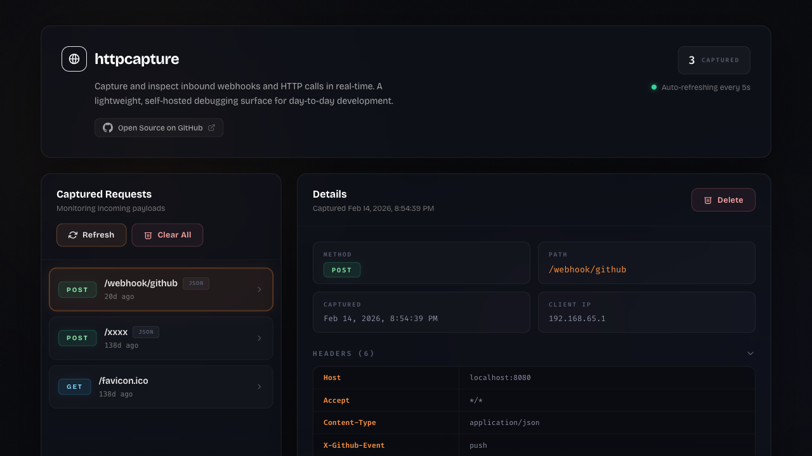

# httpcapture

Capture, inspect, and debug inbound HTTP requests and webhooks in real-time.

[](LICENSE)
[](https://github.com/agarzon/httpcapture/releases)
[](https://hub.docker.com/r/agarzon/httpcapture)




## Quick Start

```bash
docker run -p 8080:8080 agarzon/httpcapture
```

Open [http://localhost:8080](http://localhost:8080) to see the dashboard, then send any HTTP request to the same host:

```bash
curl -X POST http://localhost:8080/my/webhook \
  -H "Content-Type: application/json" \
  -d '{"event": "test", "data": {"message": "Hello!"}}'
```

The request appears instantly in the UI.

## How It Works

Any HTTP request sent to a path other than `/` and `/api/*` is automatically captured and stored in a local SQLite database. The web UI polls for new captures every 5 seconds and displays method, path, headers, query parameters, body, form data, and uploaded files.

No external dependencies. No configuration required. Just run and capture.

## API Reference

| Method | Endpoint | Description |
| --- | --- | --- |
| `GET` | `/` | Web UI |
| `GET` | `/api/requests` | List captured requests (paginated) |
| `GET` | `/api/requests/{id}` | Retrieve a single capture |
| `DELETE` | `/api/requests/{id}` | Delete a capture |
| `DELETE` | `/api/requests` | Delete all captures |
| `*` | Any other path | Captured automatically |

The list endpoint accepts `page` (1-based) and `per_page` (max 100, default 10) query parameters.

## Configuration

| Setting | Default | Details |
| --- | --- | --- |
| Polling interval | 5 seconds | Adjust `POLLING_INTERVAL_MS` in `public/assets/app.js` |
| Storage | SQLite in `storage/` | Persisted via Docker volume |
| IP detection | `X-Forwarded-For` | Falls back to `REMOTE_ADDR` |

### Request Filtering

Common noise paths are ignored by default (`/favicon.ico`, `/robots.txt`, etc.). You can extend filtering in `src/Http/RequestFilter.php`:

```php
$filter->ignorePath('/health');
$filter->ignorePathPrefix('/internal/');
$filter->ignoreExtensions(['css', 'js', 'map']);
```

## Development

```bash
# Start the development server
docker compose up --build

# Run tests
docker compose exec app composer test

# Run linter (PSR-12)
docker compose exec app composer lint
```

### Project Layout

```
public/          Vue 3 SPA and PHP entry point
src/             Application code (controllers, HTTP, persistence)
tests/           PHPUnit test suite
storage/         SQLite database (gitignored)
```

## Contributing

Contributions are welcome! See [CONTRIBUTING.md](CONTRIBUTING.md) for guidelines.

## License

[MIT](LICENSE)
